# MandiMitra XAI — Project Report

## Explainable AI Platform for Agricultural Price Forecasting in Madhya Pradesh

---

## Table of Contents

1. [Abstract](#1-abstract)
2. [Introduction & Problem Statement](#2-introduction--problem-statement)
3. [Objectives](#3-objectives)
4. [Literature Survey](#4-literature-survey)
5. [System Architecture](#5-system-architecture)
6. [Technology Stack](#6-technology-stack)
7. [Module Description](#7-module-description)
8. [Data Pipeline & APIs](#8-data-pipeline--apis)
9. [Machine Learning Model](#9-machine-learning-model)
10. [Explainability (XAI) Framework](#10-explainability-xai-framework)
11. [Decision Engine](#11-decision-engine)
12. [Frontend Design](#12-frontend-design)
13. [Project Structure](#13-project-structure)
14. [Database Schema](#14-database-schema)
15. [API Endpoints](#15-api-endpoints)
16. [Testing & Validation](#16-testing--validation)
17. [Deployment](#17-deployment)
18. [Results & Screenshots](#18-results--screenshots)
19. [Future Scope](#19-future-scope)
20. [Conclusion](#20-conclusion)
21. [References](#21-references)

---

## 1. Abstract

**MandiMitra XAI** is a full-stack, production-grade Explainable Artificial Intelligence (XAI) platform designed to assist farmers in Madhya Pradesh (India) with data-driven agricultural decisions. The system integrates real-time government market data from **data.gov.in** (Agmarknet), live weather forecasting from **Open-Meteo API**, and a **PyTorch LSTM neural network** with attention mechanism to forecast mandi prices for 10 major crops across 10 districts for a 14-day horizon.

Unlike conventional black-box AI systems, MandiMitra XAI emphasizes **transparency** by providing SHAP-based explanations for every prediction, enabling farmers to understand *why* the AI recommends a particular action. The platform further offers a **Sell vs. Store Decision Engine** and a **Harvest Window Optimizer** that consider soil moisture, wind speed, humidity, and crop spoilage dynamics.

**Keywords:** Explainable AI, Agricultural Price Forecasting, LSTM, SHAP, Decision Support System, Open Data, Madhya Pradesh

---

## 2. Introduction & Problem Statement

### 2.1 Background

India is primarily an agrarian economy. In Madhya Pradesh alone, over 70% of the rural population depends on agriculture. Farmers face a fundamental challenge: **informational asymmetry**. They lack access to accurate price forecasts and have limited ability to decide whether to sell their produce immediately or store it for a better future price. This results in:

- **Post-harvest losses** of up to 35% in perishable crops (ICAR, 2023)
- **Distress selling** at sub-optimal prices
- **Revenue losses** of ₹92,000 crore annually in India (NABARD estimates)

### 2.2 Problem Statement

> *Design and implement an Explainable AI platform that can predict agricultural commodity prices in Madhya Pradesh mandis, explain the reasoning behind its predictions to non-technical users (farmers), and provide actionable recommendations (sell, store, or harvest timing) using real-time government and weather data.*

### 2.3 Motivation

Existing agricultural price prediction systems suffer from three critical shortcomings:
1. **Black-box models** — Farmers cannot understand or trust opaque predictions.
2. **Static datasets** — Most systems use historical CSV files, not live government feeds.
3. **Single-dimensional** — They predict price but don't provide actionable guidance (e.g., "Should I sell today or store for 7 days?").

MandiMitra XAI addresses all three by combining transparent AI, live API integration, and a multi-factor decision engine.

---

## 3. Objectives

| # | Objective | Status |
|---|-----------|--------|
| 1 | Build a 14-day price forecasting model using LSTM with Attention | ✅ Implemented |
| 2 | Provide SHAP-based explanations for every prediction | ✅ Implemented |
| 3 | Integrate live mandi price data from data.gov.in API | ✅ Implemented |
| 4 | Integrate live weather forecasts from Open-Meteo API | ✅ Implemented |
| 5 | Build a Sell vs. Store Decision Support System | ✅ Implemented |
| 6 | Build a Harvest Window Optimizer with weather-aware scoring | ✅ Implemented |
| 7 | Support 10 crops and 10 MP districts | ✅ Implemented |
| 8 | Support bilingual interface (English + Hindi) | ✅ Implemented |
| 9 | Create a modern, farmer-friendly UI | ✅ Implemented |

---

## 4. Literature Survey

| Paper / Source | Key Contribution | How MandiMitra Uses It |
|----------------|-----------------|----------------------|
| Hochreiter & Schmidhuber (1997) — LSTM | Long Short-Term Memory networks for sequence prediction | Core price prediction model |
| Lundberg & Lee (2017) — SHAP | SHapley Additive exPlanations for model interpretability | XAI explanation module |
| Bahdanau et al. (2015) — Attention | Attention mechanism for sequence-to-sequence models | Attention layer in LSTM to focus on relevant time steps |
| FAO (2023) — Post-Harvest Loss | Up to 40% loss in developing countries due to poor market info | Problem motivation |
| Agmarknet / data.gov.in | Government open data for daily mandi prices | Live data pipeline |
| Open-Meteo | Free, open-source weather forecast API | Weather feature engineering |

---

## 5. System Architecture

```mermaid
graph TB
    subgraph "External APIs"
        A[🇮🇳 data.gov.in<br/>Agmarknet API] 
        B[🌦️ Open-Meteo<br/>Weather API]
    end

    subgraph "Data Ingestion Layer"
        C[fetch_live_mandi_data.py<br/>Async Price Sync]
        D[download_weather.py<br/>Historical Weather Download]
    end

    subgraph "Database Layer"
        E[(MongoDB Atlas<br/>Cloud Database)]
    end

    subgraph "ML Engine"
        F[PyTorch LSTM<br/>+ Attention]
        G[SHAP Explainer]
        H[Decision Engine<br/>Sell vs Store + Harvest]
    end

    subgraph "Backend API (FastAPI)"
        I["/api/v1/predict"]
        J["/api/v1/explain"]
        K["/api/v1/recommend"]
        L["/api/v1/harvest"]
        M["/api/v1/crops & mandis"]
    end

    subgraph "Frontend (React + Vite)"
        N[Dashboard]
        O[Price Forecast]
        P[Explanation Page]
        Q[Recommendation Page]
        R[Harvest Optimizer]
    end

    A --> C --> E
    B --> D --> E
    B --> H
    E --> F
    F --> G
    F --> H
    F --> I
    G --> J
    H --> K
    H --> L
    I --> N
    I --> O
    J --> P
    K --> Q
    L --> R
```



### 5.1 Architecture Highlights

| Layer | Technology | Purpose |
|-------|-----------|---------|
| **Data Ingestion** | Python `httpx`, `openmeteo-requests` | Async data fetching from government and weather APIs |
| **Database** | MongoDB Atlas + Motor (async driver) | Store historical prices and weather data |
| **ML Pipeline** | PyTorch, NumPy, Pandas, scikit-learn | Train and serve LSTM neural network |
| **Explainability** | SHAP (SHapley Additive exPlanations) | Feature importance attribution |
| **Backend API** | FastAPI + Uvicorn | High-performance async REST API |
| **Frontend** | React 18 + Vite + Recharts | Interactive single-page application |
| **Caching** | Redis (Upstash) | Cache predictions for 1 hour |

---

## 6. Technology Stack

### 6.1 Backend

| Technology | Version | Purpose |
|------------|---------|---------|
| Python | 3.11 | Core programming language |
| FastAPI | 0.111.0 | Async web framework |
| Uvicorn | 0.30.0 | ASGI server |
| Pydantic | 2.7.1 | Request/response validation |
| Motor | 3.4.0 | Async MongoDB driver |
| PyMongo | 4.6.3 | MongoDB operations |
| httpx | 0.27.0 | Async HTTP client (Open-Meteo live fetch) |

### 6.2 Machine Learning

| Technology | Version | Purpose |
|------------|---------|---------|
| PyTorch | 2.3.0 | Deep learning framework |
| NumPy | 1.26.4 | Numerical computation |
| Pandas | 2.2.2 | Data manipulation |
| scikit-learn | 1.5.0 | Feature scaling (MinMaxScaler) |
| SHAP | 0.45.1 | Explainable AI |
| XGBoost | 2.0.3 | Baseline model comparison |

### 6.3 Data Pipeline

| Technology | Version | Purpose |
|------------|---------|---------|
| openmeteo-requests | 1.2.0 | Official Open-Meteo Python client |
| requests-cache | 1.2.1 | Cache API responses locally |
| retry-requests | 2.0.0 | Auto-retry on failed downloads |

### 6.4 Frontend

| Technology | Version | Purpose |
|------------|---------|---------|
| React | 18.x | UI component library |
| Vite | 5.x | Build tool & dev server |
| Recharts | 2.x | Chart visualizations |
| Axios | 1.x | HTTP client |
| date-fns | 3.x | Date formatting |
| React Router | 6.x | Client-side routing |

### 6.5 Infrastructure

| Technology | Purpose |
|------------|---------|
| MongoDB Atlas | Cloud-hosted NoSQL database |
| Redis (Upstash) | Serverless caching |
| Docker | Containerization |
| GitHub Actions | CI/CD pipeline |

---

## 7. Module Description

### 7.1 Module 1: Price Forecasting Engine

**Purpose:** Predict commodity prices for the next 14 days with confidence intervals.

**Input:** 30-day historical feature vector (13 features) including price lags, arrival volumes, weather data, and temporal encodings.

**Output:** 14 daily predictions with `predicted_price`, `lower_bound`, `upper_bound`, `confidence`, `trend`, and `risk_level`.

**Algorithm:** LSTM with Attention (2 layers, 128 hidden units, dropout 0.2).

---

### 7.2 Module 2: Explainable AI (XAI)

**Purpose:** Answer the question *"Why does the AI predict this price?"*

**Method:** SHAP (SHapley Additive exPlanations) computes the marginal contribution of each input feature to the prediction. The top 5 most influential features are displayed with:
- Feature name (in English and Hindi)
- SHAP value (₹ impact)
- Direction (positive/negative)
- Human-readable explanation

**Example Output:**
> "Recent rainfall (12.5mm) has **increased** the predicted price by ₹85. Heavy rain disrupts supply chains and reduces arrivals at the mandi."

---

### 7.3 Module 3: Sell vs. Store Decision Engine

**Purpose:** Recommend whether a farmer should sell immediately or store produce for a better future price.

**Factors Considered:**
1. **Price Trend** — Are prices rising or falling over the next 14 days?
2. **Spoilage Risk** — How fast does this specific crop deteriorate? (e.g., Tomato: 1.5%/day vs. Wheat: 0.1%/day)
3. **Storage Costs** — ₹2.5 per quintal per day
4. **Weather Impact** — If temperature >30°C AND humidity >70%, spoilage rate is **doubled** for perishable crops
5. **Market Volatility** — Width of confidence intervals indicates prediction uncertainty

**Decision Logic:**
```
IF (future_profit - storage_cost - spoilage_loss) > (current_price * quantity)
    THEN → STORE (wait for better price)
    ELSE → SELL NOW
```

---

### 7.4 Module 4: Harvest Window Optimizer

**Purpose:** Find the best day to harvest within the next 14 days by maximizing a composite **Revenue Score**.

**Revenue Score Formula:**
```
Revenue_Score = Predicted_Price × Yield_Factor × Weather_Score
```

**Weather Score Penalties:**
| Condition | Penalty | Agricultural Reason |
|-----------|---------|-------------------|
| Rainfall > 10mm | ×0.2 | Crops get waterlogged |
| Soil Moisture > 0.4 | ×0.3 | Tractors get stuck in mud |
| Wind Speed > 40 km/h | ×0.5 | Crop lodging (flattening) |

---

### 7.5 Module 5: Live Data Pipeline

**Purpose:** Replace static mock data with real-time government feeds.

| Script | Source | Data |
|--------|--------|------|
| `fetch_live_mandi_data.py` | data.gov.in API | Daily prices for 10 crops × 10 mandis |
| `download_weather.py` | Open-Meteo Archive API | 2+ years of daily historical weather |

---

## 8. Data Pipeline & APIs

### 8.1 data.gov.in (Agmarknet) API

**Endpoint:** `https://api.data.gov.in/resource/9ef84268-d588-465a-a308-a864a43d0070`

**Authentication:** API Key (included in `.env`)

**Data Retrieved:**
- `arrival_date` — Date of market trading
- `commodity` — Crop name
- `market` — Mandi name
- `min_price`, `max_price`, `modal_price` — Daily price range (₹/quintal)
- `arrival_quantity` — Volume arrived at mandi (tonnes)

**Processing:**
- Date strings (`dd/mm/yyyy`) are parsed into Python `datetime` objects
- String prices are converted to floats with missing-value fallback
- Records are upserted (update-or-insert) into MongoDB using `bulk_write`

### 8.2 Open-Meteo API

**Endpoints Used:**
| Endpoint | Purpose |
|----------|---------|
| `api.open-meteo.com/v1/forecast` | 14-day future weather for live predictions |
| `archive-api.open-meteo.com/v1/archive` | 2+ years historical weather for ML training |

**Variables Fetched:**
| Variable | Unit | Agricultural Relevance |
|----------|------|----------------------|
| `temperature_2m_max` | °C | Heat stress on crops |
| `precipitation_sum` | mm | Flooding, supply disruption |
| `soil_moisture_0_to_7cm` | m³/m³ | Harvest feasibility |
| `wind_speed_10m_max` | km/h | Crop lodging risk |
| `relative_humidity_2m_max` | % | Spoilage acceleration |

---

## 9. Machine Learning Model

### 9.1 Model Architecture — LSTM with Attention

```
Input (batch, 30 timesteps, 13 features)
    │
    ▼
┌─────────────────────────┐
│  LSTM Layer 1           │  128 hidden units
│  (bidirectional=False)  │  dropout=0.2
└────────┬────────────────┘
         │
┌────────▼────────────────┐
│  LSTM Layer 2           │  128 hidden units
│                         │  dropout=0.2
└────────┬────────────────┘
         │
┌────────▼────────────────┐
│  Attention Mechanism    │  Learns which of the 30
│  (Bahdanau-style)       │  past days matter most
└────────┬────────────────┘
         │
┌────────▼────────────────┐
│  Fully Connected Layer  │  128 → 14 (mean predictions)
│  + Variance Head        │  128 → 14 (uncertainty estimation)
└─────────────────────────┘

Output: 14-day price forecast with confidence intervals
```

### 9.2 Feature Engineering (13 Features)

| # | Feature | Description |
|---|---------|-------------|
| 1 | `price_lag_1` | Yesterday's closing price |
| 2 | `price_lag_7` | Price 7 days ago |
| 3 | `price_lag_14` | Price 14 days ago |
| 4 | `price_lag_30` | Price 30 days ago |
| 5 | `arrival_volume` | Mandi arrival volume (quintals) |
| 6 | `rainfall_mm` | Daily rainfall |
| 7 | `temperature_max` | Max daily temperature |
| 8 | `month_sin` | Sine encoding of month (seasonality) |
| 9 | `month_cos` | Cosine encoding of month |
| 10 | `day_of_week_sin` | Sine encoding of weekday |
| 11 | `day_of_week_cos` | Cosine encoding of weekday |
| 12 | `price_rolling_7d_mean` | 7-day moving average of price |
| 13 | `price_rolling_7d_std` | 7-day price volatility |

### 9.3 Training Configuration

| Parameter | Value |
|-----------|-------|
| Optimizer | Adam |
| Learning Rate | 0.001 |
| Loss Function | MSE + NLL (for uncertainty) |
| Batch Size | 32 |
| Epochs | 100 |
| Early Stopping | Patience = 10 |
| Lookback Window | 30 days |
| Forecast Horizon | 14 days |

---

## 10. Explainability (XAI) Framework

### 10.1 Why Explainability Matters

For a farmer in MP, a prediction like *"Tomato price will be ₹2,800 next week"* is useless without context. The farmer needs to know:
- **Is it because of heavy rainfall?** → Then prices might rise even more.
- **Is it because of high arrivals?** → Then storage might be pointless as supply is high.

### 10.2 SHAP Implementation

```python
# Compute SHAP values for the input features
shap_values = explainer.compute(input_tensor)

# Rank features by absolute SHAP value
top_5_features = sorted(features, key=|shap_value|, reverse=True)[:5]

# Generate human-readable explanation
# Example: "Arrival volume (1200 quintals) has DECREASED price by ₹120"
```

### 10.3 Attention Weights Visualization

The attention mechanism reveals *which past days* the model considers most important. For example, if last Monday's price was an outlier, the attention weight for that day will be high, and the SHAP attribution will reflect its influence.

---

## 11. Decision Engine

### 11.1 Crop Spoilage Rates

| Crop | Daily Spoilage Rate | Category |
|------|-------------------|----------|
| 🍅 Tomato | 1.5% | High Risk |
| 🥔 Potato | 0.6% | Medium Risk |
| 🧅 Onion | 0.4% | Medium Risk |
| 🧄 Garlic | 0.3% | Medium Risk |
| 🫘 Soybean | 0.2% | Low Risk |
| 🌽 Maize | 0.15% | Low Risk |
| 🥜 Gram/Chana | 0.15% | Low Risk |
| 🌾 Wheat | 0.1% | Very Low |
| 🌼 Mustard | 0.1% | Very Low |
| ☁️ Cotton | 0.1% | Very Low |

### 11.2 Humidity-Aware Spoilage Multiplier

```
IF temperature > 30°C AND humidity > 70%:
    spoilage_rate = spoilage_rate × 2.0  # Doubled!
```

This innovative feature uses **live Open-Meteo humidity data** to dynamically adjust the spoilage model. In hot, humid conditions (common during MP's monsoon), perishable crops like tomatoes and potatoes deteriorate at twice the normal rate.

---

## 12. Frontend Design

### 12.1 Design Philosophy

- **Farmer-First:** Large text, emoji icons, Hindi support, and simple language
- **Premium Aesthetics:** Glassmorphic navbar, gradient hero, animated cards
- **Responsive:** Works on mobile phones (important for rural users)
- **Bilingual:** Full English/Hindi toggle across all pages

### 12.2 Pages

| Page | Route | Purpose |
|------|-------|---------|
| Home | `/` | Landing page with hero, features, and CTA buttons |
| Dashboard | `/dashboard` | Live crop prices with interactive chart and key drivers |
| Price Forecast | `/forecast` | 14-day price chart with confidence bands |
| Explanation | `/explain` | SHAP waterfall visualization showing feature impacts |
| Recommendation | `/recommend` | Sell vs. Store decision with factor breakdown |
| Harvest Optimizer | `/harvest` | 14-day harvest window with weather cards |

### 12.3 Design System

| Token | Value | Usage |
|-------|-------|-------|
| Primary Color | `#166534` (Dark Green) | Agriculture theme |
| Accent Color | `#f59e0b` (Gold) | Highlights and CTAs |
| Font | Inter + Noto Sans Devanagari | Latin + Hindi support |
| Border Radius | 8px–24px | Soft, modern feel |
| Shadows | 4-tier system (sm, md, lg, xl) | Depth and hierarchy |
| Animations | fadeInUp, slideInLeft, float | Micro-interactions |

---

## 13. Project Structure

```
mandimitra-xai/
├── backend/                    # FastAPI Backend
│   ├── main.py                 # Application entry point
│   ├── config.py               # Environment settings (Pydantic)
│   ├── routers/                # API endpoint handlers
│   │   ├── predict.py          # POST /api/v1/predict
│   │   ├── explain.py          # POST /api/v1/explain
│   │   ├── recommend.py        # POST /api/v1/recommend
│   │   ├── harvest.py          # POST /api/v1/harvest
│   │   ├── crops.py            # GET  /api/v1/crops
│   │   ├── mandis.py           # GET  /api/v1/mandis
│   │   └── health.py           # GET  /health
│   ├── schemas/                # Pydantic request/response models
│   │   ├── prediction.py
│   │   ├── explanation.py
│   │   ├── recommendation.py
│   │   └── harvest.py
│   └── services/               # Business logic
│       ├── model_service.py    # ML model orchestration
│       ├── data_service.py     # MongoDB + Weather fetching
│       └── cache_service.py    # Redis caching
│
├── ml/                         # Machine Learning Pipeline
│   ├── models/
│   │   └── lstm_attention.py   # LSTM + Attention model definition
│   ├── explainability/
│   │   └── shap_explainer.py   # SHAP computation wrapper
│   ├── optimization/
│   │   └── decision_engine.py  # Sell/Store + Harvest logic
│   ├── data/
│   │   ├── preprocessor.py     # Feature engineering
│   │   └── weather.py          # Weather data utilities
│   ├── training/
│   │   └── train.py            # Model training script
│   └── saved_models/           # Trained model weights (.pt)
│
├── frontend/                   # React Frontend
│   ├── src/
│   │   ├── App.jsx             # Root component with routing
│   │   ├── main.jsx            # Entry point
│   │   ├── pages/              # Page components (6 pages)
│   │   ├── components/         # Reusable UI components
│   │   │   ├── charts/         # PriceChart, ShapWaterfall, etc.
│   │   │   └── ui/             # LanguageToggle, RecommendationCard
│   │   ├── services/
│   │   │   └── api.js          # Axios API service
│   │   └── styles/
│   │       └── globals.css     # Design system
│   └── index.html
│
├── scripts/                    # Automation Scripts
│   ├── fetch_live_mandi_data.py  # data.gov.in → MongoDB sync
│   ├── download_weather.py       # Open-Meteo → CSV (ML training)
│   └── seed_mock_data.py         # Generate test data
│
├── data/raw/                   # Historical weather CSVs
├── docker/                     # Docker configuration
├── .github/workflows/          # CI/CD (GitHub Actions)
├── requirements.txt            # Python dependencies
└── .env                        # Environment variables
```

---

## 14. Database Schema

### 14.1 Prices Collection (MongoDB)

```json
{
  "_id": "ObjectId(...)",
  "date": "2026-03-30T00:00:00Z",
  "crop": "tomato",
  "mandi": "indore",
  "min_price": 1800.0,
  "max_price": 2400.0,
  "modal_price": 2100.0,
  "arrival_tonnes": 245.5
}
```

**Index:** Compound unique index on `(crop, mandi, date)` for fast upserts.

---

## 15. API Endpoints

| Method | Endpoint | Description | Input |
|--------|----------|-------------|-------|
| `POST` | `/api/v1/predict` | 14-day price forecast | `{ crop, mandi, horizon_days }` |
| `POST` | `/api/v1/explain` | SHAP explanation | `{ crop, mandi, horizon_days }` |
| `POST` | `/api/v1/recommend` | Sell vs. Store decision | `{ crop, mandi, quantity_quintals }` |
| `POST` | `/api/v1/harvest` | Harvest window optimization | `{ crop, mandi }` |
| `GET`  | `/api/v1/crops` | List of supported crops | — |
| `GET`  | `/api/v1/mandis` | List of supported mandis | — |
| `GET`  | `/health` | Health check | — |

---

## 16. Testing & Validation

### 16.1 Backend Testing
- Unit tests for each router endpoint
- GitHub Actions CI/CD runs `pytest` on every commit

### 16.2 Data Validation
- Live sync from data.gov.in: **46+ records** successfully upserted per run
- Historical weather: **1,184 days** × 10 mandis downloaded via `openmeteo-requests`

### 16.3 Model Validation
- Mock predictions serve as fallback when the trained model file is unavailable
- Confidence intervals (80%) are computed using learned variance

---

## 17. Deployment

### 17.1 Local Development

```bash
# Terminal 1 — Backend
cd mandimitra-xai
source venv/bin/activate
uvicorn backend.main:app --reload

# Terminal 2 — Frontend
cd mandimitra-xai/frontend
npm run dev
```

### 17.2 Production Deployment

| Component | Platform | URL |
|-----------|----------|-----|
| Frontend | Vercel | `mandimitra.vercel.app` |
| Backend | Render | `mandimitra-api.onrender.com` |
| Database | MongoDB Atlas | Cloud cluster |
| Cache | Upstash Redis | Serverless |

### 17.3 Docker

```bash
docker-compose -f docker/docker-compose.yml up --build
```

---

## 18. Results & Screenshots

### 18.1 Supported Coverage

| Dimension | Count | Details |
|-----------|-------|---------|
| **Crops** | 10 | Tomato, Onion, Wheat, Soybean, Garlic, Potato, Mustard, Gram/Chana, Maize, Cotton |
| **Districts** | 10 | Indore, Bhopal, Ujjain, Jabalpur, Sagar, Gwalior, Mandsaur, Khargone, Vidisha, Hoshangabad |
| **Forecast** | 14 days | With confidence intervals |
| **APIs** | 2 live | data.gov.in + Open-Meteo |

### 18.2 Key Metrics

| Metric | Value |
|--------|-------|
| API Response Time | < 500ms (cached) |
| Historical Data | 1,184 days per mandi |
| Weather Variables | 5 (temp, rain, soil, wind, humidity) |
| SHAP Features | Top 5 displayed per prediction |
| Languages | 2 (English + Hindi) |

---

## 19. Future Scope

1. **SMS/WhatsApp Alerts:** Push price alerts to farmers via SMS using Twilio or WhatsApp Business API.
2. **Voice Interface:** Add voice-based interaction in Hindi for farmers who cannot read.
3. **Satellite Imagery:** Integrate NDVI (vegetation index) data from Sentinel-2 satellites to improve yield estimation.
4. **Multi-State Expansion:** Extend beyond MP to Rajasthan, UP, Maharashtra, and Karnataka.
5. **Crop Disease Prediction:** Use weather + soil data to predict disease outbreaks (e.g., late blight in potatoes).
6. **Blockchain Traceability:** Record price predictions on a blockchain for audit and trust.
7. **Mobile App:** Build a React Native mobile app for offline-first usage in low-connectivity areas.

---

## 20. Conclusion

MandiMitra XAI successfully demonstrates the potential of **Explainable Artificial Intelligence** in transforming agricultural decision-making. By combining real-time government data, advanced weather analytics, and transparent machine learning, the platform empowers farmers with:

1. **Price Visibility** — 14-day forecasts with confidence intervals
2. **Decision Clarity** — Clear sell vs. store recommendations with factor-by-factor reasoning
3. **Harvest Confidence** — Weather-aware harvest date optimization
4. **Trust** — Every prediction is explained in simple, bilingual language

The system proves that AI for agriculture doesn't have to be a black box. When farmers understand *why* the AI recommends an action, they are far more likely to adopt it — leading to better outcomes for India's agricultural economy.

---

## 21. References

1. Hochreiter, S., & Schmidhuber, J. (1997). Long Short-Term Memory. *Neural Computation, 9*(8), 1735–1780.
2. Lundberg, S. M., & Lee, S. I. (2017). A Unified Approach to Interpreting Model Predictions. *Advances in Neural Information Processing Systems, 30*.
3. Bahdanau, D., Cho, K., & Bengio, Y. (2015). Neural Machine Translation by Jointly Learning to Align and Translate. *ICLR 2015*.
4. Ministry of Agriculture, Government of India. *Agmarknet — Agricultural Marketing Information Network.* https://agmarknet.gov.in
5. Open-Meteo. *Free Weather API.* https://open-meteo.com
6. data.gov.in. *Open Government Data Platform India.* https://data.gov.in
7. NABARD. (2023). *Agricultural Marketing and Post-Harvest Loss Assessment.* National Bank for Agriculture and Rural Development.
8. ICAR. (2023). *Status of Post-Harvest Losses in India.* Indian Council of Agricultural Research.

---

> **Developed as a B.Tech Capstone Project**
> 
> **Platform:** MandiMitra XAI v1.0
> **Domain:** Agricultural AI / Explainable AI
> **Region:** Madhya Pradesh, India
